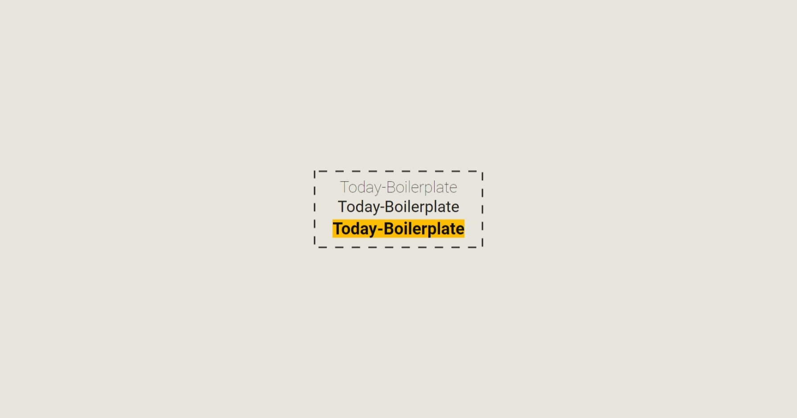

<h1 align="center">
Pokédex w React Js/ Next Js and Typescript</h1>

<br />



<br/>

<div align="center">
  <a href="#description">Description</a> &nbsp;&nbsp;&nbsp;|&nbsp;&nbsp;&nbsp <a href="#install">Install</a> &nbsp;&nbsp;&nbsp;|&nbsp;&nbsp;&nbsp <a href="#technologies">Technologies</a> &nbsp;&nbsp;&nbsp;|&nbsp;&nbsp;&nbsp <a href="#related">Related</a> &nbsp;&nbsp;&nbsp;|&nbsp;&nbsp;&nbsp <a href="#references">References</a> &nbsp;&nbsp;&nbsp;|&nbsp;&nbsp;&nbsp <a href="#contact">Contact</a>
</div>

<br />
<br />

<h3 id="description">✍️ Description:</h3>

<p>This project was made with the latest technologies using Next Js (v13).The biggest trump of Next Js is that,out of the box, offers Server-Side-Rendering with Static-Site-Generation,which gives us much more velocity and stability as public project - even i made as an educational project; This is a really robust project for to study. Have Fun!</p>

<br />

<h3 id="install">🔍  Install:</h3>

<p>To create this project I have used React, but as long as I stated with npm, I think you are going to have problems to use with yarn.The best tip gave to you as a beginner is use npm or migrate to yarn, if all you want is just try - use npm:<p>

**To install the package:**

```npm install```


**To run correct script:**

<p>To run this project, all you need to do is run the index.html, in public folder. I personally recommend to use LiveServer extension of VS Code</p>

<br />

<h3 id="technologies">🚀  Technologies:</h3>

<p>To build this project is used:</p>

- HTML 5
- CSS 3
- Javascript
- Typescript
- NPM
- Node
- EditorConfig

<br />

<h3 id="related">♟️  Related:</h3>

See more:

<ul>
  <li><a href="https://github.com/samuelcarvalhodeveloper/Google-Clone-w-React-Js-Typescript-Styled-Components-Prettier-Eslint-EditorConfig">Google Clone</a></li>
  <li><a href="https://github.com/samuelcarvalhodeveloper/Pinterest-Clone-w-React-Js-Typescript-Styled-Components-Prettier-Eslint-EditorConfig">Pinterest Clone</a></li>
  <li><a href="https://github.com/samuelcarvalhodeveloper/Starbucks-Clone-w-React-Js-Typescript-Context-Api-Styled-Components-Prettier-Eslint-EditorConfig">Starbucks Clone</a></li>
  <li><a href="https://github.com/samuelcarvalhodeveloper/Facebook-Clone-w-React-Js-Typescript-Styled-Components-Prettier-Eslint-EditorConfig">Facebook Clone</a></li>
  <li><a href="https://github.com/samuelcarvalhodeveloper/Calculator-w-React-Js-Redux-ToolKit-Typescript-Styled-Components-Prettier-Eslint-EditorConfig">Calculator w/ Redux</a></li>
</ul>

<br />

<h3 id="contact">✉️  Contact:</h3>

**Email:**
<a href="mailto:personal.samuelcarvalho@gmail.com">personal.samuelcarvalho@gmail.com</a>

<br />
<br />

<p align="center"><strong>Repository Link:</strong></p>

[https://github.com/samuelcarvalhodeveloper/Typescript-Boilerplate](https://github.com/samuelcarvalhodeveloper/Typescript-Boilerplate)
